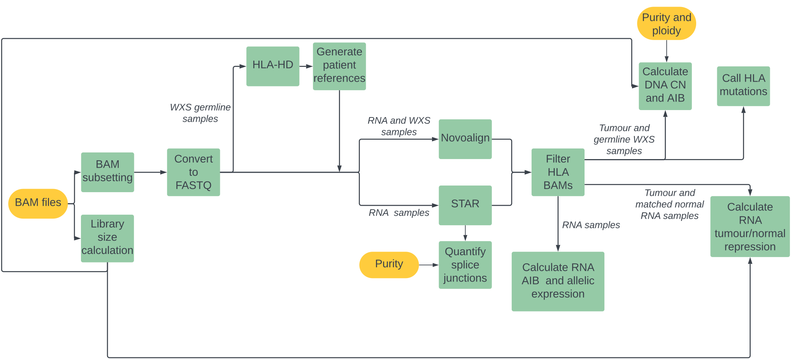

## Introduction

MHC Hammer is a bioinformatics pipeline designed for the analysis of the class I HLA genes using paired-end WXS and RNAseq data. 

Depending on the input data, the following analysis can be run:

DNA analysis from the WXS data:
* Call DNA allelic imbalance in the tumour samples
* Call allelic copy number in the tumour samples (if tumour purity and ploidy is provided)
* Call loss of heterozygosity in the tumour samples (if tumour purity and ploidy is provided)
* Call and predict the consequences of allelic somatic mutations  in the tumour samples

RNA analysis from the RNAseq data:
* Calculate allelic expression in the tumour and normal samples
* Call allele repression or over expression in the tumour samples compared to a match normal sample (only if the patient has a matched normal sample)
* Call allelic alternative splicing in the tumour and normal samples

## Pipeline overview


## Steps before running the pipeline
 
### 1. Installing Nextflow and Singularity
1. Install [`Nextflow`](https://www.nextflow.io/docs/latest/getstarted.html#installation) (`>=21.10.3`)

2. Install [`Singularity`](https://www.sylabs.io/guides/3.0/user-guide/)

### 2. Make an inventory file

You need to create a inventory file with the following columns:
- patient - the patient name. MHC Hammer will replace spaces in the patient name with underscores. Required.
- sample_name - the sample name. MHC Hammer will replace spaces in the sample name with underscores. Required.
- sample_type - either `tumour` or `normal`.  Required.
- bam_path - full path to the WXS or RNAseq BAM file. Required.
- sequencing_type - either `wxs` or `rnaseq`.  Required.
- purity - the purity of the tumour region. Can be left empty.
- ploidy - the ploidy of the tumour region. Can be left empty.
- normal_sample_name - when sequencing_type is `wxs` this is the matched germline WXS. When sequencing_type is `rnaseq` this is the matched RNAseq normal name. Can be left empty.

The inventory should be a csv file and is input to the pipeline with the `--input` parameter. 

The following is an example inventory for a single patient with:
- two tumour regions with WXS (sample_name1 and sample_name2), one of which has RNAseq (sample_name1)
- one germline WXS sample (sample_name3)
- one normal RNAseq sample (sample_name4)

|  patient |  sample_name | sample_type | bam_path                 | sequencing_type | purity | ploidy | normal_sample_name |
| :------: | :----------: | :---------: | :----------------------: | :-------------: | :----: | :----: | :--------------: |
| patient1 | sample_name1 |   tumour    | path/to/sample_name1.bam |       wxs       |   0.5  |    3   |   sample_name3   |
| patient1 | sample_name2 |   tumour    | path/to/sample_name2.bam |       wxs       |   0.3  |   2.5  |   sample_name3   |
| patient1 | sample_name3 |   normal    | path/to/sample_name3.bam |       wxs       |        |        |                  |
| patient1 | sample_name1 |   tumour    | path/to/sample_name4.bam |       rnaseq    |        |        |   sample_name4   |
| patient1 | sample_name4 |   normal    | path/to/sample_name5.bam |       rnaseq    |        |        |                  |

### 3. Clone this repo
```bash
git clone git@github.com:McGranahanLab/mhc-hammer.git
mkdir mhc-hammer/singularity_images
cd mhc-hammer
project_dir=${PWD}
```

### 4. Download the MHC Hammer reference files
The reference files to run MHC Hammer can be downloaded from Zenodo: https://zenodo.org/records/11059410
This should download two folders, `kmer_files` and `mhc_references`. Save these folders in the assets folder:
- `assets/kmer_files/imgt_30mers.fa` - This file contains all 30mers created from the sequences in the IMGT database. For an overview of how this file was created see `docs/mhc_reference_files.md`
- `assets/mhc_references` - this folder contains the MHC reference files used in the MHC Hammer pipeline. For an overview of how these file were created see `docs/mhc_reference_files.md`

### 5. HLA allele typing
Every sample run through MHC Hammer requires HLA allele types. MHC Hammer provides three options for typing HLA alleles:
1. Install [HLA-HD](https://pubmed.ncbi.nlm.nih.gov/28419628/) locally. MHC Hammer will run the locally installed HLA-HD.
2. Create a container containing HLA-HD. MHC Hammer will run HLA-HD using this container.
3. Provide HLA allele types as an input to MHC Hammer, in this case MHC Hammer will  not run HLA-HD.

**The HLA allele types predicted by HLA-HD (option 1 or 2) or input to MHC Hammer (option 3) must match the alleles in the MHC Hammer reference files**

This means that if using HLA-HD within MHC Hammer (option 1 or 2) the reference version used by HLA-HD must be the same as the IMGT reference version used to create the MHC Hammer reference files. If HLA allele types are input to MHC Hammer, these allele types must be present in the MHC Hammer reference files. More information on this is prodived below.

#### Option 1: Install HLA-HD and its dependencies locally (recommended)

The steps are as follows:
1. On the HLA-HD website fill in the [download request form](https://www.genome.med.kyoto-u.ac.jp/HLA-HD/download-request/) to get a download link for HLA-HD
2. Move the downloaded hlahd.version.tar.gz file into the project bin directory.
   ```bash
   mv /path/to/hlahd_download.tar.gz ${project_dir}/bin/
   ```
3. Run the [install_hlahd.sh](scripts/install_hlahd.sh) script. This script will:
   - install HLA-HD and bowtie2 (2.5.1) and store them in the `${project_dir}/bin/` directory. 
   - update the HLA-HD allele dictionary to the IMGT database version 3.55. This is the same IMGT version that is used to make the reference files saved in the `assets/mhc_references` folder. 

   This `install_hlahd.sh` script requires:
   - g++ and wget to be installed
   - The mhc_hammer_preprocessing_latest.sif to be in the `$project_dir/singularity_images/` folder.
   - The `hlahd_download` variable to be set as the path to /path/to/hlahd_download.tar.gz.

   To run `install_hlahd.sh`:
   ```bash
   bash ${project_dir}/scripts/install_hlahd.sh -p ${project_dir} -h ${hlahd_download}
   ```

   If you want to use a different version of the IMGT database with HLA-HD you can change the following line in `scripts/install_hlahd.sh` to your choosen version of the IMGT database:
   ```
   $singularity_command sed -i 's,wget https://media.githubusercontent.com/media/ANHIG/IMGTHLA/Latest/hla.dat,wget https://media.githubusercontent.com/media/ANHIG/IMGTHLA/v3.55.0-alpha/hla.dat,' update.dictionary.sh
   ```
   Alternatively you can comment out this line to use HLA-HD with the most recent IMGT release. **Remember that the HLA-HD database version should match the version used to create the files in the `assets/mhc_references` folder.**

4. When running the pipeline ensure you run with ```--local_hlahd_install true```

#### Option 2: Create your own HLA-HD singularity container

We are unable to provide a singularity container for HLA-HD tool. Instead, we have provided steps to create your own container:

1. On the HLA-HD website fill in the [download request form](https://www.genome.med.kyoto-u.ac.jp/HLA-HD/download-request/) to get a download link for HLA-HD
2. Edit the `assets/hlahd_container.def` file:
   - Update the `/path/to/downloaded/hlahd.version.tar.gz` in the `%files` section 
   - Update the `HLAHD_VERSION` variable in the `%post` section 
3. Build the singularity image:
   ```bash
   singularity build hlahd.sif assets/hlahd_container_template.def
   ``` 
4. Move the image into the singularity_images directory
   ```bash
   mv hlahd.sif singularity_images
   ```
5. When running the MHC Hammer pipeline ensure you run with `--hlahd_local_install false`.

If you want to use a different version of the IMGT database with HLA-HD you can change the following line in `assets/hlahd_container.def` to your choosen version of the IMGT database:
```
sed -i 's,wget https://media.githubusercontent.com/media/ANHIG/IMGTHLA/Latest/hla.dat,wget https://media.githubusercontent.com/media/ANHIG/IMGTHLA/v3.55.0-alpha/hla.dat,' update.dictionary.sh
```
Alternatively you can comment out this line to use HLA-HD with the most recent IMGT release. **Remember that the HLA-HD database version should match the version used to create the files in the `assets/mhc_references` folder.**

#### Option 3: Input HLA alleles to MHC Hammer

If you already have HLA allele types for your samples you can skip the HLA-HD step in the pipeline. To do this:
- add a new column to the inventory called `hla_alleles_path` that contains  the path to a csv file listing the HLA alleles. This table should have three columns with no column names. The columns are:
   -  Gene 
   - Allele 1 type
   - Allele 2 type

An example of the file format can be found here: https://github.com/McGranahanLab/mhc-hammer/blob/main/test/data/SIM001_hla_alleles.csv

- run the pipeline with the `--run_hlahd false` flag.

**Remember that the alleles input to MHC Hammer must be present in the MHC Hammer reference files in the `assets/mhc_references` folder.** You can get a list of alleles from the fasta file, e.g. `grep '^>' assets/mhc_references/mhc_genome.fasta`

### 6. Update the pipeline parameters and config files

To ensure that the MHC Hammer pipeline works on your HPC system, you can update the variables in `conf/hpc.config`. This can be provided to the pipeline using the `-c` parameter. Alternatively, if it exists, you can use a config file specific for your institute. See this [page](https://www.nextflow.io/docs/latest/config.html) for more information on nextflow config files.

You can update MHC Hammer pipeline parameters in the `nextflow.conf` file. Alternatively, you can change the parameters by inputting them directly when you run the pipeline. For a full overview of the pipeline parameters run:
```bash
nextflow run main.nf --help --show_hidden_params
```

## Running the MHC Hammer pipeline

To run the MHC Hammer pipeline:
```bash
nextflow run main.nf \
--input /path/to/inventory \
-c conf/hpc.config -resume
```

The `-resume` flag tells the pipeline to not rerun tasks that have sucessfully completed. See this [page](https://www.nextflow.io/blog/2019/demystifying-nextflow-resume.html) for more information on Nextflow caching.

To change a pipeline parameter, either change the parameter in the `nextflow.conf` file, or directly as an input to the pipeline. Parameters input to the pipeline take precedence over parameters in the `nextflow.conf` file. For example, to change the `min_depth` parameter:
```bash
nextflow run main.nf \
--input /path/to/inventory \
-c conf/hpc.config \
--min_depth 5 -resume
```

## Running the MHC Hammer pipeline with subsetted BAM files and flagstat output
If you already have subsetted BAM files and flagstat output, you can input these to the MHC Hammer pipeline instead of rerunning these steps. To do this:
- the `bam_path` column in the inventory file should contain the path to the subsetted BAM files
- add a new column to the inventory called `library_size_path` that contains  the path to a text file with the library size for the sample. This can be calculated from the flagstat output. 
- run the pipeline with the `--run_bam_subsetting false` flag.

## MHC Hammer pipeline outputs
By defult, the output is saved in the working directory in a folder called `mhc_hammer_results`. See `docs/mhc_hammer_outputs.md` for an overview of all outputs from MHC Hammer.

## Test dataset
A test dataset is provided. The input BAMs and inventory are in the `test_data` folder. Note that you will need to update the inventory columns `bam_path` and `hla_alleles_path` so that they contain the full paths to the file.

To run the pipeline with the test dataset, including the HLA-HD step:
```bash
nextflow run main.nf -profile test,singularity --input test/test_data/mhc_hammer_test_inventory.csv
```

To run the pipeline with the test dataset, without the HLA-HD step:
```bash
nextflow run main.nf -profile test,singularity --input test/data/mhc_hammer_test_inventory.csv --run_hlahd false
```

The output will be saved in the `test/results` folder.

## Files downloaded in the assets directory

Files downloaded with the git repository
- `codon_table.csv` - contains a mapping between codons and amino acids, this is used to determine the consequence of alternate splicing events in the HLA alleles.
- `contigs_placeholder.txt` - This is a placeholder for the subset BAM module. It will be ignored if user inputs a new path to a contigs file.
- `hlahd_container_template.def` - A template for [making a HLA-HD singularity file](#option-2-create-your-own-hla-hd-singularity-container)
- `mhc_coords_chr6.txt` - these genomic coordinates can be used when subsetting the bams. Any reads falling within these coordinates are included in the subsetted bams. 
- `strand_info.txt` - contains a mapping between the HLA gene and the strand (forward="+" or reverse="-")
- `transcriptome_placeholder.txt` - A placeholder so the pipeline will run with only WXS data.

## Citations
<!-- If you use  McGranahanLab/mhc_hammer for your analysis, please cite it using the following doi: [10.5281/zenodo.XXXXXX](https://doi.org/10.5281/zenodo.XXXXXX) -->

This pipeline uses code and infrastructure developed and maintained by the [nf-core](https://nf-co.re) initative, and reused here under the [MIT license](https://github.com/nf-core/tools/blob/master/LICENSE).

 > The nf-core framework for community-curated bioinformatics pipelines.
 >
 > Philip Ewels, Alexander Peltzer, Sven Fillinger, Harshil Patel, Johannes Alneberg, Andreas Wilm, Maxime Ulysse Garcia, Paolo Di Tommaso & Sven Nahnsen.
 >
 > Nat Biotechnol. 2020 Feb 13. doi: 10.1038/s41587-020-0439-x.
 >

An extensive list of references for the tools used by the pipeline can be found in the [CITATIONS.md](CITATIONS.md) file.
